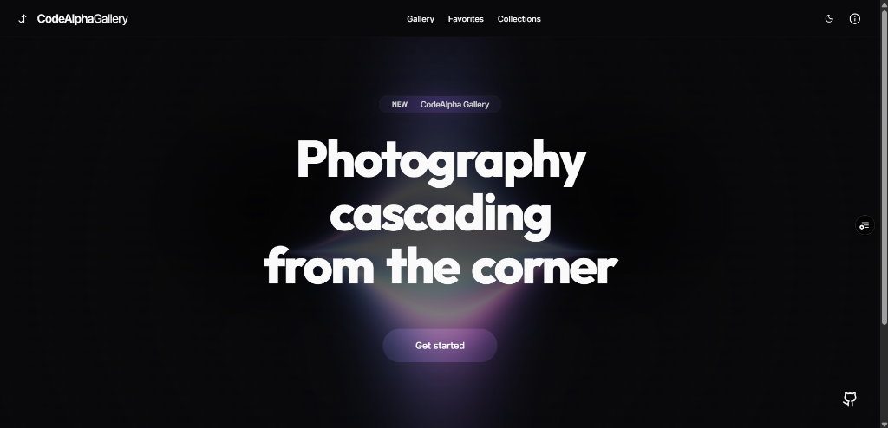
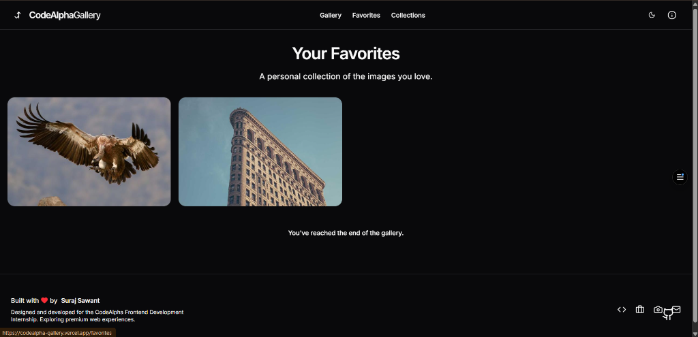

<div align="center">

# 🌌 CodeAlpha Image Gallery

**A Premium Responsive Image Gallery built with React, TypeScript, Tailwind CSS, and Framer Motion.**

[](https://react.dev/)
[](https://www.typescriptlang.org/)
[](https://vitejs.dev/)
[](https://tailwindcss.com/)
[](https://www.framer.com/motion/)

[](https://opensource.org/licenses/MIT)
[](https://github.com/daystar-1nine/CodeAlpha_ImageGallery/stargazers)
[](https://github.com/daystar-1nine/CodeAlpha_ImageGallery)
[](https://github.com/daystar-1nine/CodeAlpha_ImageGallery)

<p align="center">
  This project was developed as part of the <b>CodeAlpha Frontend Development Internship</b>. Instead of creating a basic image gallery, I designed a premium web application that demonstrates modern frontend engineering, beautiful UI/UX, accessibility, responsive design, animations, and scalable React architecture.
</p>

</div>

---

## 🚀 Live Demo

**Experience the application live:**
[https://codealpha-gallery.vercel.app/](https://codealpha-gallery.vercel.app/)

---

## 📸 Screenshots

| Landing Page (Dark) | Landing Page (Light) |
| :---: | :---: |
|  |  |

| Gallery & Masonry Grid | Image Lightbox |
| :---: | :---: |
|  |  |

| Favorites Dashboard | Custom Collections |
| :---: | :---: |
|  |  |

| Mobile Responsive View |
| :---: |
|  |

---

## ✨ Features

- [x] **Responsive Design** - Flawlessly scales from 320px mobile screens to 4K desktop monitors.
- [x] **Dark Mode / Light Mode** - Full theme engine with `localStorage` persistence and System Theme detection.
- [x] **Masonry Layout** - Advanced CSS column-based interlocking grid preserving original aspect ratios.
- [x] **Infinite Scroll** - Seamlessly load more images without breaking the user experience.
- [x] **Live Search** - 500ms debounced real-time searching capabilities.
- [x] **Category Filters** - Pre-defined dynamic chips to instantly pivot genres (Nature, Architecture, etc.).
- [x] **Favorites** - Heart images to save them to a persistent personal dashboard.
- [x] **Collections** - Create custom folders and organize your curated photography library.
- [x] **Lightbox** - High-resolution, full-screen modal viewer with zoom and keyboard navigation.
- [x] **Image Zoom** - Smooth micro-animations on hover using custom bezier curves.
- [x] **Keyboard Navigation** - Fully traversable using `Tab`, `Enter`, and Arrow keys.
- [x] **Lazy Loading** - `loading="lazy"` attributes drastically reduce initial bandwidth.
- [x] **Skeleton Loading** - Beautiful blurred pulsing placeholders eliminate Cumulative Layout Shift (CLS).
- [x] **Smooth Animations** - Framer Motion orchestrates page transitions and UI micro-interactions.
- [x] **Accessibility** - Semantic HTML, Focus Rings, and strict ARIA labeling.
- [x] **Performance Optimization** - Implemented `React.memo` to prevent re-renders in heavy grids.
- [x] **Glassmorphism UI** - Modern backdrop blurs and frosted glass panels.
- [x] **Mobile Friendly** - Interactive touch-friendly drawers and off-canvas navigation.

---

## 🛠 Tech Stack

| Technology | Description |
| :--- | :--- |
| **React (v18)** | Component-based UI library managing complex reactive state. |
| **TypeScript** | Strict syntactical superset ensuring type safety and reducing runtime errors. |
| **Vite** | Ultra-fast build tool and development server with instant HMR. |
| **Tailwind CSS** | Utility-first CSS framework for rapid, highly-customizable responsive styling. |
| **Framer Motion** | Production-ready motion library for physics-based animations. |
| **Shadcn UI** | Beautiful, accessible, and customizable components built on Radix primitives. |
| **Lucide Icons** | Clean, consistent, and lightweight open-source icon toolkit. |
| **React Router** | Client-side routing for seamless page navigation. |

---

## 📁 Folder Structure

```text
CodeAlpha_ImageGallery/
├── public/                 # Static assets (Favicon, Avatars)
├── src/                    # Source code root
│   ├── components/         # Reusable React components
│   │   ├── gallery/        # Masonry Grid, ImageCard, BlurImage
│   │   ├── layout/         # Navbar, Footer, PageWrapper, InfoPanel
│   │   └── ui/             # Generic UI elements (Buttons, Inputs, Modals)
│   ├── hooks/              # Custom React Hooks (Debounce, Favorites, Collections)
│   ├── pages/              # Route-level components (Home, Gallery, Collections)
│   ├── services/           # External API / Data fetching logic
│   ├── types/              # Global TypeScript interfaces
│   ├── constants/          # Hardcoded data/configurations
│   └── lib/                # Utility functions (Tailwind merge)
└── docs/                   # Project Design Report (PDR) and screenshots
```
- **`components/`**: Houses all modular UI elements utilizing Atomic Design principles.
- **`hooks/`**: Encapsulates all business logic, side-effects, and `localStorage` synchronization.
- **`pages/`**: Represents distinct views injected into the React Router.

---

## 💻 Installation

Follow these steps to run the project locally on your machine.

```bash
# 1. Clone the repository
git clone https://github.com/daystar-1nine/CodeAlpha_ImageGallery.git

# 2. Navigate into the directory
cd CodeAlpha_ImageGallery

# 3. Install the dependencies
npm install

# 4. Start the development server
npm run dev
```

Visit `http://localhost:5173` in your browser to view the application.

```bash
# 5. Build for production
npm run build

# 6. Preview the production build locally
npm run preview
```

---

## 📖 Usage

- **Searching:** Use the search bar in the Gallery to instantly filter images. The input is debounced by 500ms for optimal performance.
- **Filtering:** Click on any of the category chips (e.g., *Architecture*, *Technology*) to quickly pivot the grid to specific genres.
- **Favorites:** Click the Heart icon on any image. It will instantly be saved to your persistent **Favorites Dashboard**.
- **Collections:** Click the Plus icon to open the Collections Modal. Create a new folder (e.g., "Moodboard") and add the image to it.
- **Lightbox:** Click directly on an image to open the high-resolution, full-screen viewer.
- **Theme Switching:** Use the sun/moon icon in the navigation bar to toggle between Light Mode, Dark Mode, and System Default.

---

## ⌨️ Keyboard Shortcuts

| Shortcut | Action |
| :--- | :--- |
| `ESC` | Close Lightbox / Close Modals |
| `Left Arrow` | Previous Image (in Lightbox) |
| `Right Arrow` | Next Image (in Lightbox) |
| `Tab` | Traverse focusable interactive elements |
| `Enter` | Select focused element / Open image |
| `F` | Toggle Favorite (when image is focused) |

---

## ⚡ Performance

- **Lazy Loading:** Images only download when they approach the viewport, saving immense bandwidth.
- **Code Splitting:** Vite automatically chunks the JavaScript bundle for faster initial page loads.
- **Memoization:** Complex grid items use `React.memo` to prevent React from unnecessarily re-rendering untouched nodes.
- **Optimized Images:** High-resolution assets are gracefully loaded over lightweight blurred placeholders.
- **Smooth Animations:** Framer Motion utilizes hardware-accelerated CSS transforms instead of layout-thrashing position animations.

---

## ♿ Accessibility

- **Keyboard Friendly:** Full support for keyboard navigation with visible focus rings (`focus-visible:ring-primary`).
- **ARIA Labels:** All icon-only buttons contain descriptive screen-reader attributes.
- **Screen Reader Support:** Semantic HTML5 landmarks (`<nav>`, `<main>`, `<dialog>`) are used structurally.
- **Contrast:** Custom color variables are engineered to pass WCAG contrast guidelines in both Light and Dark modes.

---

## 🏗 Project Architecture

This application is built with a highly scalable **Client-Side Rendering (CSR)** architecture:
- **Reusable Components:** The UI is completely modularized. For example, `BlurImage.tsx` handles all image rendering logic, ensuring consistency across the entire app.
- **Custom Hooks:** Business logic is entirely decoupled from the UI. `useFavorites` and `useCollections` act as independent state controllers managing the `localStorage` mock database.
- **Type Safety:** Strict TypeScript interfaces ensure data contracts are respected, eliminating the risk of undefined runtime properties.

---

## 🚀 Future Improvements

While this project satisfies the internship requirements, the architecture supports massive scalability. Potential upgrades include:

- 🤖 **AI Image Search:** Vector-based semantic searching.
- ☁️ **Cloud Storage:** Transitioning from local mocks to AWS S3 / Unsplash API.
- 🔐 **Authentication:** OAuth integration for multi-device syncing.
- 📤 **Upload Images:** Enabling user-generated content.
- 🗜 **Image Compression:** Client-side resizing prior to uploads.
- 📷 **EXIF Viewer:** Parsing and displaying aperture, ISO, and camera model.
- 🎨 **Color Palette Generator:** Extracting dominant colors from images.
- 🔗 **Share API:** Generating public URLs for custom collections.
- 📱 **PWA Support:** Installing the app natively on mobile devices.
- 🚫 **Offline Mode:** Using Service Workers to cache favorites for offline viewing.

---

## 🤝 Contributing

Contributions, issues, and feature requests are welcome!
Feel free to check the [issues page](https://github.com/daystar-1nine/CodeAlpha_ImageGallery/issues).

1. Fork the Project
2. Create your Feature Branch (`git checkout -b feature/AmazingFeature`)
3. Commit your Changes (`git commit -m 'Add some AmazingFeature'`)
4. Push to the Branch (`git push origin feature/AmazingFeature`)
5. Open a Pull Request

---

## 📜 License

Distributed under the MIT License. See `LICENSE` for more information.

---

## 👨‍💻 Developer

<div align="center">
  
  
  <h3>Suraj Sawant</h3>
  <p><b>Frontend Developer</b></p>
  
  [](https://github.com/daystar-1nine)
  [](https://www.linkedin.com/in/surajsawant19062005/)
  [](https://suraj1nine.vercel.app/)
  [](mailto:surajonenine@gmail.com)
</div>

---

## 💖 Support

If you found this project helpful, learned something new, or simply appreciate the design, please consider giving it a ⭐ on GitHub! It helps a lot!
