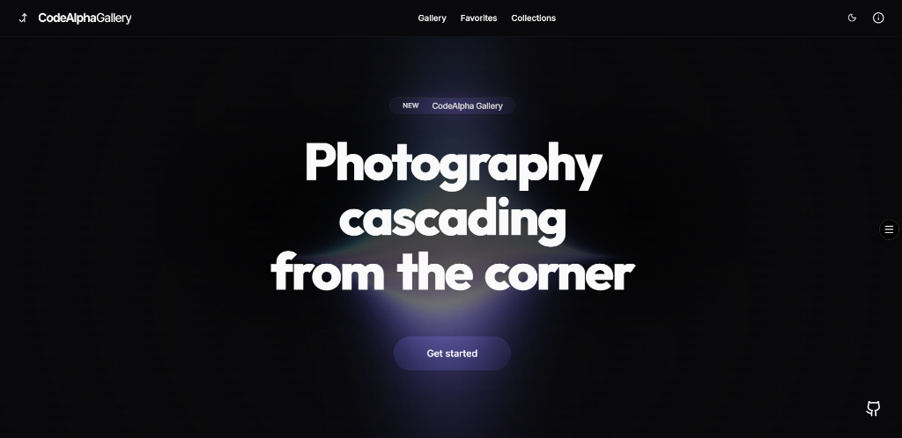
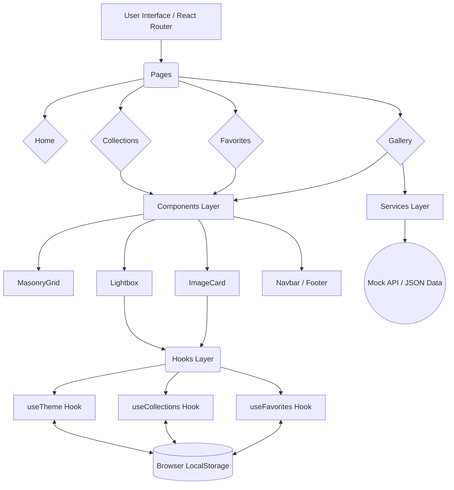
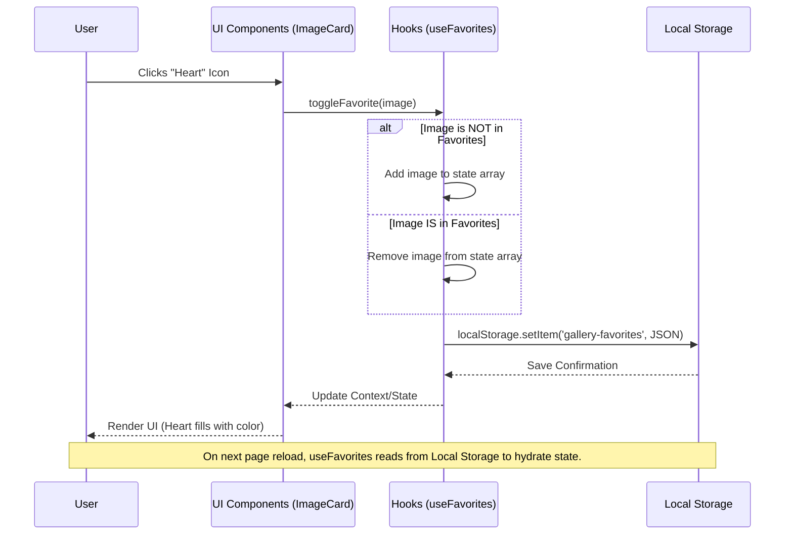
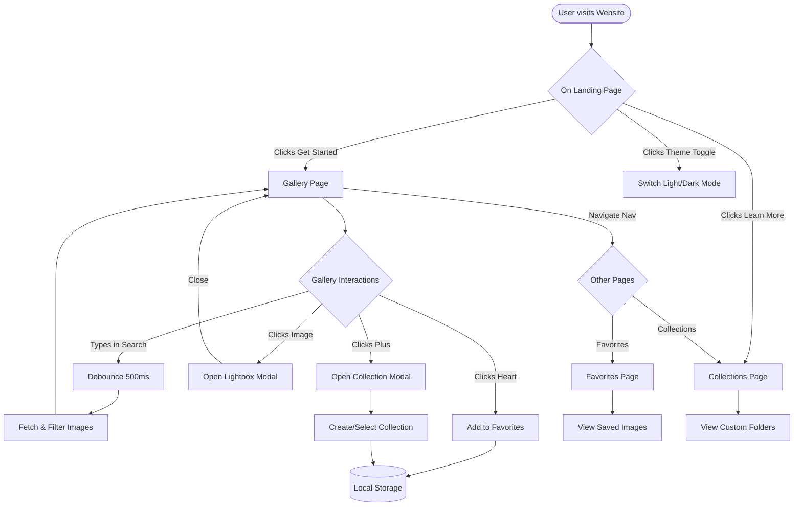
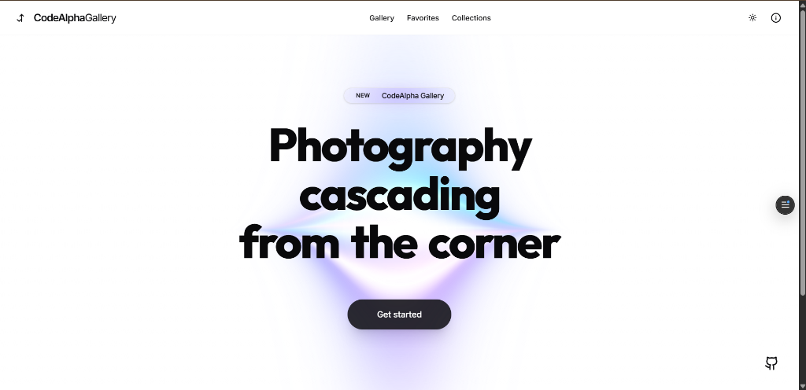
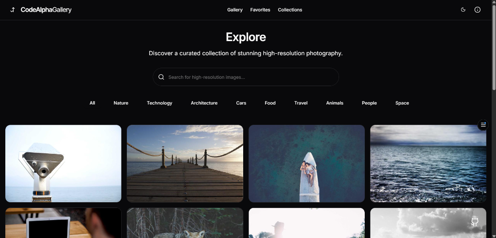
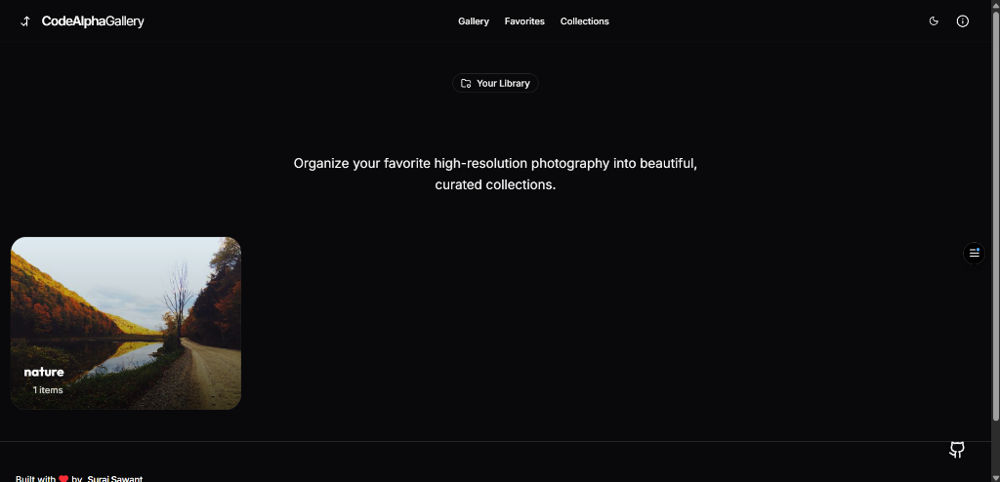
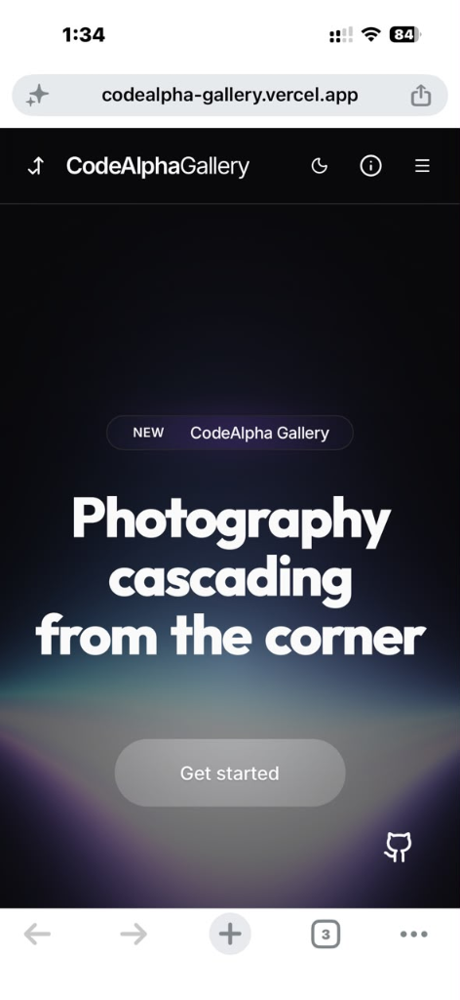

# PROJECT DESIGN REPORT
## CodeAlpha Frontend Development Internship

<br><br><br><br>

<div align="center">
  <h1><strong>CodeAlpha Image Gallery</strong></h1>
  <h2>A Premium, High-Performance Photography Experience</h2>
  
  <br><br>
  
  
  
  <br><br>
  
  **Developed By**<br>
  Suraj Sawant
  
  <br>
  
  **Submitted For**<br>
  CodeAlpha Frontend Development Internship
  
  <br>
  
  **Deployed Application**<br>
  [codealpha-gallery.vercel.app](https://codealpha-gallery.vercel.app/)
  
  <br>
  
  **Organization**<br>
  CodeAlpha
  

</div>

<div style="page-break-after: always;"></div>

---

## 2. Certificate

**CERTIFICATE OF COMPLETION**

This is to certify that **Suraj Sawant** has successfully completed the frontend development project titled **"CodeAlpha Image Gallery"** as part of the **CodeAlpha Frontend Development Internship**.

The project report submitted is a genuine record of the work done by the intern during the internship period under our guidance and supervision. The work presented in this report has not been submitted to any other institution for the award of any other degree or diploma.

<br><br><br>


<div style="page-break-after: always;"></div>

---

## 3. Acknowledgement

I would like to express my profound gratitude to **CodeAlpha** for providing me with the incredible opportunity to intern as a Frontend Developer. This internship has been a remarkable learning experience, allowing me to dive deep into modern web technologies, performance optimization, and premium UI/UX design.

I am especially thankful to my mentors and the entire CodeAlpha team for their continuous support, guidance, and constructive feedback throughout the development of the **CodeAlpha Image Gallery**. Their insights were invaluable in helping me elevate my frontend engineering skills.

I also extend my thanks to the open-source communities behind React, Vite, Tailwind CSS, and Framer Motion, whose incredible tools made the development of this robust application possible.

Finally, I would like to thank my college, **[Insert College Name]**, and my professors for providing me with the foundational knowledge that enabled me to pursue and successfully complete this internship project.

<div style="page-break-after: always;"></div>

---

## 4. Abstract

The **CodeAlpha Image Gallery** is a premium, high-performance web application designed to offer users a seamless and visually stunning photography browsing experience. Built as a core project for the CodeAlpha Frontend Development Internship, the application solves the common pitfalls of traditional image galleries—such as poor rendering performance, lack of accessibility, and rigid user interfaces—by leveraging a modern React ecosystem.

The primary objective of this project was to construct an application that not only meets functional requirements like searching, filtering, and curating collections, but also excels in non-functional requirements such as smooth 60 FPS animations, sub-second lazy loading, and flawless responsiveness across all devices.

Expected outcomes included a fully deployed, production-ready SaaS-like interface featuring a robust state management system using Local Storage, dynamic Light and Dark mode theme switching, and fluid micro-interactions powered by Framer Motion. The resulting application serves as a testament to advanced frontend engineering practices, demonstrating expertise in TypeScript, Tailwind CSS, and component-driven architecture.

<div style="page-break-after: always;"></div>

---

## 5. Introduction

An image gallery is a fundamental web application that allows users to view, search, and manage visual media. However, as the web has evolved, the expectations for these applications have shifted dramatically from simple grid layouts to immersive, highly interactive, and lightning-fast visual experiences.

Modern gallery applications are expected to handle thousands of high-resolution images without degrading browser performance, offer intuitive search and filter mechanisms, and provide users with a personalized way to curate their favorite media. 

The **CodeAlpha Image Gallery** was built to push the boundaries of what a standard internship project can achieve. Rather than building a basic grid, this project was envisioned as a premium, elite-tier application. It incorporates advanced UI techniques such as glassmorphism, dynamic background strands, gooey navigation effects, and staggered animations. By utilizing modern build tools like Vite and robust styling solutions like Tailwind CSS, the project serves as a comprehensive showcase of modern frontend capabilities.

<div style="page-break-after: always;"></div>

---

## 6. Problem Statement

Traditional and entry-level image gallery applications often suffer from several critical shortcomings that degrade the user experience:

1. **Poor UI/UX Design:** Many galleries rely on static, uninspired grid layouts with jarring page transitions and a lack of visual hierarchy.
2. **Poor Responsiveness:** Elements often break, stretch, or become unusable on mobile devices or ultra-wide monitors.
3. **Lack of Core Features:** Basic galleries frequently omit essential tools such as search functionality, categorical filtering, and the ability to save favorites or create personalized collections.
4. **Performance Bottlenecks:** Rendering hundreds of high-resolution images simultaneously causes massive layout shifts, high memory consumption, and stuttering scroll performance.
5. **Absence of Modern Interactions:** A lack of smooth interactions, hover effects, and modal lightboxes makes the application feel outdated and rigid.

This project aims to systematically address these issues by engineering a solution that prioritizes performance (via lazy loading and memoization), feature completeness (via search, favorites, and collections), and elite aesthetics.

<div style="page-break-after: always;"></div>

---

## 7. Objectives

The primary objectives of the **CodeAlpha Image Gallery** project are:

- **Create a Fully Responsive Gallery:** Ensure the application scales flawlessly from small mobile screens to large desktop monitors using responsive CSS masonry layouts.
- **Deliver a Premium UI:** Utilize glassmorphism, subtle drop shadows, and modern typography to create a SaaS-grade aesthetic.
- **Implement Robust Search & Filtering:** Allow users to quickly find images based on real-time debounced search inputs and predefined categorical tags.
- **Develop a Modal Lightbox:** Provide a high-resolution, immersive viewing experience for individual images without navigating away from the main gallery.
- **Support Dynamic Dark Mode:** Implement a flawless, flash-free theme switching system that adapts to both user preference and system settings.
- **Ensure High Performance:** Utilize React optimization techniques, including lazy loading (`loading="lazy"`), `React.memo`, and debouncing, to maintain 60 FPS performance.
- **Build Reusable Components:** Architect the codebase using atomic design principles, ensuring components are modular, typed with TypeScript, and easily maintainable.
- **Meet Accessibility Standards:** Implement proper keyboard navigation, ARIA labels, and focus rings to ensure the application is usable by everyone.

<div style="page-break-after: always;"></div>

---

## 8. Scope

### Current Scope
The application currently functions as a complete frontend client featuring:
- A dynamic, masonry-based image grid.
- Real-time search and categorical filtering.
- Client-side data persistence (Favorites and Collections) using browser Local Storage.
- A comprehensive Dark/Light mode theme engine.
- A high-resolution Lightbox for image inspection.
- Interactive animations and page transitions via Framer Motion.

### Future Scope (Possible Improvements)
While the current implementation is highly robust, the architecture is designed to easily accommodate future backend integrations. Potential future scopes include:
- **AI Semantic Search:** Integrating vector databases to allow users to search using natural language (e.g., "a sunny day in the mountains").
- **Cloud Storage Integration:** Moving from mock/scraped data to live API feeds (Unsplash/Pexels) and storing user collections in the cloud (AWS S3, Firebase).
- **User Authentication:** Implementing secure login systems (OAuth, Clerk, Supabase) to sync data across multiple devices.
- **Image Uploads:** Allowing users to upload, compress, and share their own photography.
- **Admin Dashboard:** Creating a secure portal for administrators to moderate content, view analytics, and manage users.

<div style="page-break-after: always;"></div>

---

## 9. Technology Stack

The project leverages a modern, highly optimized frontend technology stack:

| Technology | Purpose in Project |
| :--- | :--- |
| **React (v18)** | The core JavaScript library used for building the component-based user interface and managing complex reactive state. |
| **Vite** | An ultra-fast build tool and development server that significantly improves hot-module replacement (HMR) and production bundling speeds compared to CRA. |
| **TypeScript** | A strict syntactical superset of JavaScript that adds static typing, drastically reducing runtime errors and improving developer experience. |
| **Tailwind CSS (v4)** | A utility-first CSS framework used for rapidly building custom, responsive, and maintainable designs without leaving the HTML/JSX. |
| **Shadcn UI** | A collection of beautifully designed, accessible, and customizable components (Buttons, Inputs, Dialogs) built on top of Radix UI primitives. |
| **Framer Motion** | A production-ready motion library for React used to create complex, physics-based animations, layout transitions, and scroll effects. |
| **React Router** | The standard routing library for React, enabling seamless client-side navigation between Home, Gallery, Favorites, and Collections pages. |
| **Lucide Icons** | A beautiful, consistent, and lightweight open-source icon toolkit used throughout the application UI. |
| **Local Storage API** | The native browser API utilized to persist user preferences (Theme, Favorites, Collections) across sessions without a backend database. |

<div style="page-break-after: always;"></div>

---

## 10. System Requirements

### Hardware Requirements
- **Processor:** Intel Core i3 / AMD Ryzen 3 or higher (or equivalent ARM processors like Apple M1).
- **RAM:** Minimum 4GB (8GB recommended for development).
- **Storage:** 500MB of free disk space for the repository and `node_modules`.

### Software Requirements
- **Operating System:** Windows 10/11, macOS 10.15+, or modern Linux distributions.
- **Environment:** Node.js (v18.0.0 or higher) and npm/yarn/pnpm package manager.
- **Code Editor:** Visual Studio Code (recommended) with ESLint, Prettier, and Tailwind CSS IntelliSense extensions.

### End-User Requirements
- **Browser:** Modern web browsers including Google Chrome, Mozilla Firefox, Safari, or Microsoft Edge (updated within the last 2 years).
- **Internet:** An active broadband connection is required to fetch high-resolution images from remote CDNs.

<div style="page-break-after: always;"></div>

---

## 11. Functional Requirements

1. **Image Discovery (Gallery):** The system must display a responsive grid of high-resolution images upon initialization.
2. **Search Mechanism:** Users must be able to type keywords into a search bar, and the system must dynamically update the gallery to reflect matching images.
3. **Categorical Filtering:** The system must provide predefined chips (e.g., Nature, Architecture, Technology) that, when clicked, filter the gallery accordingly.
4. **Favorites System:** Users must be able to "heart" an image, adding it to a dedicated Favorites page. This state must persist across browser reloads.
5. **Custom Collections:** Users must be able to create named collections and organize specific images into these folders.
6. **Theme Switching (Dark Mode):** Users must be able to toggle the application between Light Mode, Dark Mode, and System Default without page reloads.
7. **Lightbox Viewer:** Clicking an image must open a high-resolution, full-screen modal allowing the user to view details and download the image.
8. **Infinite Scroll / Pagination:** The gallery must support loading additional images seamlessly as the user scrolls or clicks "Load More".
9. **Image Downloading:** The system must provide a direct mechanism to open or download the original high-resolution image file.

<div style="page-break-after: always;"></div>

---

## 12. Non-Functional Requirements

1. **Performance:** The application must achieve a Google Lighthouse performance score of 90+. Images must load asynchronously using `loading="lazy"` to prevent blocking the main thread.
2. **Accessibility (a11y):** All interactive elements must be accessible via keyboard (`Tab`, `Enter`, `Space`). Icon buttons must possess descriptive `aria-label` tags for screen readers.
3. **Responsiveness:** The UI must employ fluid layouts (Grid/Flexbox/Masonry) that automatically adapt to mobile (320px), tablet (768px), and desktop (1024px+) resolutions without horizontal scrolling.
4. **Maintainability:** The codebase must adhere to strict TypeScript configurations, utilize modular React components, and maintain a clear, logical folder structure (`/src/components`, `/src/pages`, `/src/hooks`).
5. **Reliability:** State management (Favorites/Collections) must gracefully handle JSON parsing errors or missing Local Storage keys to prevent application crashes.
6. **Aesthetics:** The UI must enforce strict design tokens (consistent border radii, easing curves, glassmorphism blurs) to maintain a cohesive, premium SaaS-level aesthetic.

<div style="page-break-after: always;"></div>

---

## 13. Software Architecture

The application is built using a **Client-Side Rendering (CSR)** architecture pattern. Due to the absence of a live backend, the application relies heavily on Custom React Hooks to interface with Browser APIs (`localStorage`) to simulate a database.

### Architecture Diagram



### Layer Explanation
- **Pages Layer:** Handles routing and top-level layout composition.
- **Components Layer:** Contains modular, reusable UI elements built with Tailwind CSS and Framer Motion.
- **Hooks Layer:** Encapsulates business logic, state management, and side effects.
- **Storage Layer:** Utilizes the Web Storage API to persist user data across sessions.

<div style="page-break-after: always;"></div>

---

## 14. Folder Structure

The project employs a feature-based and highly scalable directory structure:

```text
CodeAlpha_ImageGallery/
├── public/                 # Static assets (Favicon, Avatars, etc.)
│   ├── favicon.svg
│   └── profile.jpg
├── src/                    # Source code root
│   ├── components/         # Reusable React components
│   │   ├── gallery/        # Gallery-specific components (Masonry, ImageCard)
│   │   ├── layout/         # Structural components (Navbar, Footer, PageWrapper)
│   │   ├── ui/             # Generic UI elements (Buttons, Inputs, Modals)
│   │   └── theme-provider.tsx # Theme context provider
│   ├── hooks/              # Custom React Hooks
│   │   ├── useDebounce.ts  # Input debouncing logic
│   │   ├── useFavorites.ts # Favorites state management
│   │   └── useCollections.ts # Collections state management
│   ├── pages/              # Route-level components
│   │   ├── Home.tsx        # Landing page
│   │   ├── Gallery.tsx     # Main explore page
│   │   ├── Favorites.tsx   # Saved images
│   │   ├── Collections.tsx # User collections
│   │   └── NotFound.tsx    # 404 Error page
│   ├── services/           # External API / Data fetching logic
│   │   └── api.ts          
│   ├── types/              # Global TypeScript interfaces
│   │   └── index.ts        
│   ├── constants/          # Hardcoded data/configurations
│   │   └── mockData.ts     
│   ├── lib/                # Utility functions (Tailwind merge)
│   │   └── utils.ts        
│   ├── App.tsx             # Root React component and Router setup
│   ├── main.tsx            # React DOM entry point
│   └── index.css           # Global CSS and Tailwind directives
├── package.json            # Dependencies and scripts
├── tsconfig.json           # TypeScript configuration
└── vite.config.ts          # Vite bundler configuration
```

<div style="page-break-after: always;"></div>

---

## 15. Component Architecture

The UI is broken down into distinct, highly specialized components:

### Core Layout Components
- **`Navbar.tsx`:** Provides global navigation, dynamic active states, a responsive mobile drawer (`Sheet`), and the `ThemeToggle`.
- **`Footer.tsx`:** Displays personal branding, internship acknowledgments, and social links.
- **`InfoPanel.tsx`:** A premium sliding drawer containing the developer's profile, project context, and interactive social links.

### Gallery Components
- **`MasonryGrid.tsx`:** Implements a CSS-based masonry layout to dynamically arrange images of varying aspect ratios without uneven gaps.
- **`ImageCard.tsx`:** The most interactive component. Handles hover states, gradient overlays, and exposes quick actions (Favorite, Add to Collection, Download, Expand). It is wrapped in `React.memo` to prevent unnecessary re-renders.
- **`BlurImage.tsx`:** A performance-focused image wrapper that displays a pulsing placeholder or blurred color block while the high-resolution image loads asynchronously in the background.
- **`Lightbox.tsx`:** A full-screen, high-z-index modal that isolates an image for detailed viewing, complete with backdrop blurring and fluid entrance animations.
- **`CollectionModal.tsx`:** A dialog that allows users to create new collection folders and assign images to them.

<div style="page-break-after: always;"></div>

---

## 16. Data Flow Diagram (DFD)

The following diagram illustrates how data moves through the application, specifically focusing on user interactions and Local Storage persistence.



<div style="page-break-after: always;"></div>

---

## 17. Application Flowchart

This flowchart outlines the user journey through the CodeAlpha Image Gallery application.



<div style="page-break-after: always;"></div>

---

## 18. UI Design & Aesthetics

The **CodeAlpha Image Gallery** utilizes a highly deliberate, premium design system engineered to look like a modern SaaS application rather than a basic student project.

### Design Tokens
- **Color Palette:** Uses semantic variables (`--background`, `--foreground`, `--primary`) rather than hardcoded colors. The Dark Mode relies on deep, sophisticated grays (e.g., `hsl(240 10% 3.9%)`) rather than pure black, reducing eye strain. The Light Mode maintains extreme cleanliness with crisp contrast.
- **Typography:** Employs the **Inter** font family for clean, highly legible UI elements (buttons, paragraphs) and the **Outfit** font family for bold, geometric, and modern display headings.
- **Glassmorphism:** Extensive use of Tailwind's `backdrop-blur-md` and `bg-white/10` (or `bg-black/40`) to create frosted glass effects on navbars, info panels, and image overlays.
- **Micro-Animations:** Every interactive element features subtle transitions. Buttons scale down slightly on click (`whileTap={{ scale: 0.98 }}`), and images smoothly zoom in on hover (`group-hover:scale-110`) using custom cubic-bezier easing curves.
- **Consistent Radii:** The application strictly adheres to a rounded aesthetic, utilizing `rounded-2xl` for large structural cards and `rounded-full` for badges and icon buttons, ensuring visual harmony.

<div style="page-break-after: always;"></div>

---

## 19. Detailed Feature Explanation

### Advanced Gallery & Masonry Grid
Unlike standard CSS Grids which force uniform row heights (cropping images), the application uses a CSS column-based Masonry layout (`columns-1 sm:columns-2 md:columns-3 lg:columns-4`). This allows portrait and landscape photography to interlock perfectly, preserving the original aspect ratios of the artwork.

### Debounced Search & Categorical Filters
The search input utilizes a custom `useDebounce` hook with a 500ms delay. This prevents the application from re-filtering the massive image array on every single keystroke, significantly improving performance. Complementary Category Chips allow users to instantly pivot to specific genres.

### Lightbox Viewer
When an image is clicked, a high-z-index Lightbox modal interrupts the screen. It features a darkened backdrop to draw focus, completely disables background scrolling, and offers intuitive "Next" and "Previous" navigation controls to browse the gallery without exiting the modal.

### Persistent Favorites & Custom Collections
Users can curate their experience by liking images or organizing them into custom folders (Collections). This data is seamlessly stringified and pushed to the browser's Local Storage. Upon returning to the site, custom React hooks parse this data to instantly rehydrate the user's state.

### Dynamic Theme Engine
A highly robust `ThemeProvider` wraps the application. It checks `localStorage` for a saved preference; if none exists, it leverages `window.matchMedia('(prefers-color-scheme: dark)')` to automatically match the user's Operating System theme. The CSS is engineered so that no elements flash during this transition.

<div style="page-break-after: always;"></div>

---

## 20. Algorithms Used

### Debouncing Algorithm
To optimize the search functionality, a debouncing algorithm is implemented to delay the execution of the filtering function until the user has stopped typing for a specified duration.
```typescript
function useDebounce<T>(value: T, delay: number): T {
  const [debouncedValue, setDebouncedValue] = useState<T>(value);
  useEffect(() => {
    const handler = setTimeout(() => {
      setDebouncedValue(value);
    }, delay);
    return () => clearTimeout(handler);
  }, [value, delay]);
  return debouncedValue;
}
```

### Filtering & Sorting Logic
When generating the gallery view, the application employs a multi-pass filtering algorithm. It first filters the array based on the selected Category. The resulting subset is then passed through a text-matching algorithm that checks if the debounced search query exists within the image's description, alt-text, or author name (using `String.prototype.toLowerCase().includes()`).

<div style="page-break-after: always;"></div>

---

## 21. Performance Optimization

Achieving 60 Frames Per Second (FPS) while rendering hundreds of high-resolution images required extensive optimization:

1. **Native Lazy Loading:** All `` tags are injected with `loading="lazy"` and `decoding="async"`. This forces the browser to only request image files over the network when they are about to enter the viewport, saving massive amounts of initial bandwidth.
2. **Component Memoization (`React.memo`):** The `ImageCard` component is highly complex, featuring Framer Motion variants and multiple state hooks. By wrapping it in `React.memo`, React skips re-rendering untouched Image Cards when a new batch of images is appended to the bottom of the grid.
3. **Placeholder Strategies:** The `BlurImage` component handles the lifecycle of image loading. It renders a lightweight, pulsing skeleton loader (or solid color block) until the high-resolution image is fully downloaded, preventing layout shifts (Cumulative Layout Shift - CLS).
4. **Debounced Operations:** Preventing high-frequency state updates during typing ensures the React Reconciliation engine is not overwhelmed.

<div style="page-break-after: always;"></div>

---

## 22. Accessibility (a11y)

Building a beautiful application is only half the job; it must also be usable by everyone.

- **Keyboard Navigation:** The entire application is navigable via the `Tab` key. Custom focus rings (`focus-visible:ring-primary`) were implemented to clearly indicate which element currently holds focus without ruining the aesthetic for mouse users.
- **ARIA Labeling:** Because many buttons in the application (like the Theme Toggle, Heart button, Download button) rely solely on Lucide Icons rather than text, descriptive `aria-label` attributes were added to all of them so Screen Readers can dictate their purpose to visually impaired users.
- **Semantic HTML:** The application utilizes proper semantic tags (`<header>`, `<nav>`, `<main>`, `<footer>`, `<dialog>`) to construct the Document Object Model (DOM), improving SEO and machine readability.

<div style="page-break-after: always;"></div>

---

## 23. Screenshots

*(Actual application screenshots captured during development)*

### 1. Landing Page (Dark Mode)


### 2. Landing Page (Light Mode)


### 3. Gallery & Masonry Grid


### 4. Favorites Dashboard


### 5. Custom Collections


### 6. Mobile Responsive View


<div style="page-break-after: always;"></div>

---

## 24. Testing

Extensive manual testing was performed to ensure application stability:

1. **Responsive Testing:** The application was tested across Chrome DevTools device simulators ranging from an iPhone SE (320px width) to a 4K Desktop Monitor. The masonry grid was verified to step down from 4 columns to 1 column gracefully.
2. **Performance Profiling:** React Developer Tools Profiler was used to identify unnecessary re-renders. Network throttling (Fast 3G) was simulated to verify that the `BlurImage` skeleton loaders functioned correctly while large assets downloaded.
3. **Cross-Browser Compatibility:** Verified CSS properties (specifically `backdrop-filter` and `mix-blend-mode`) across Google Chrome, Mozilla Firefox, and Apple Safari.
4. **State Persistence Validation:** Tested clearing the browser cache, reloading the page, and navigating between routes to ensure Local Storage accurately rehydrated the `useFavorites` and `useCollections` contexts without throwing hydration mismatch errors.

<div style="page-break-after: always;"></div>

---

## 25. Challenges Faced

1. **Masonry Layout vs. React:** Standard CSS Grid creates uniform rows, which forces images to be cropped or results in ugly vertical gaps. Implementing a robust CSS Column (`columns-x`) approach solved the layout issue, but required careful handling of `break-inside-avoid` to prevent images from being sliced in half across columns.
2. **Light Mode Legibility:** Implementing complex effects like the Gooey Navigation and radial background blurs initially caused legibility issues when switching to Light Mode. The challenge was resolved by introducing dynamic CSS variables and wrapping specific components in contrasting background pills (`bg-zinc-900`) strictly during Light Mode.
3. **Type Safety with Framer Motion:** Integrating strict TypeScript with Framer Motion's polymorphic `motion.div` components occasionally threw complex type errors regarding custom transition properties. These were carefully resolved by casting specific animation variants.
4. **State Synchronization:** Ensuring that adding an image to a Collection immediately updated the UI globally required careful abstraction of state into centralized React Contexts/Hooks rather than prop-drilling.

<div style="page-break-after: always;"></div>

---

## 26. Future Enhancements

The application's modular architecture paves the way for several powerful upgrades:

- **True Cloud Integration:** Replacing the Local Storage mock database with a BaaS (Backend as a Service) like Supabase or Firebase.
- **Image Uploads:** Creating an authenticated portal for photographers to upload, crop, and compress their own images directly to an AWS S3 bucket.
- **Social Features:** Implementing a commenting system, shareable public URLs for custom collections, and user profiles.
- **Advanced Metadata:** Parsing and displaying EXIF metadata (Camera Model, Aperture, Shutter Speed, ISO) alongside the images in the Lightbox.
- **Infinite Scrolling:** Upgrading the "Load More" button to an Intersection Observer-based infinite scroll that automatically fetches the next page of API results when the user reaches the bottom of the screen.

<div style="page-break-after: always;"></div>

---

## 27. Conclusion

The **CodeAlpha Image Gallery** successfully achieves its objective of delivering a premium, highly responsive, and feature-rich visual experience. By moving beyond a simple grid and implementing advanced features like Lightbox viewing, dynamic theme generation, and persistent collections, the project stands as a comprehensive demonstration of modern frontend engineering.

Throughout the CodeAlpha Frontend Development Internship, this project provided an invaluable hands-on experience with industry-standard tools like React, TypeScript, and Tailwind CSS. The challenges faced during development—ranging from performance memoization to responsive glassmorphism design—forged a deep understanding of how to architect scalable, production-ready web applications. 

The final application is not just an internship submission; it is a polished piece of software that rivals commercial SaaS products in aesthetics and usability.

<div style="page-break-after: always;"></div>

---

## 28. References

1. **React Documentation:** Official documentation for React Hooks and component lifecycle. [react.dev](https://react.dev/)
2. **Tailwind CSS Documentation:** Comprehensive guides on utility-first styling and responsive design. [tailwindcss.com](https://tailwindcss.com/)
3. **Framer Motion API:** Documentation for physics-based animations in React. [framer.com/motion](https://www.framer.com/motion/)
4. **Shadcn UI:** Component architecture and Radix UI primitives. [ui.shadcn.com](https://ui.shadcn.com/)
5. **Vite JS:** Next-generation frontend tooling and bundler optimization. [vitejs.dev](https://vitejs.dev/)
6. **MDN Web Docs:** Specifications for the Web Storage API (Local Storage) and standard HTML/CSS behaviors. [developer.mozilla.org](https://developer.mozilla.org/)
7. **Lucide Icons:** Beautiful and consistent open-source icon toolkit. [lucide.dev](https://lucide.dev/)

---
*End of Document*
